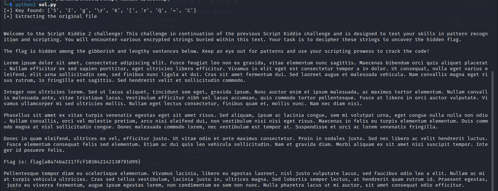

<font size='10'>Script Kiddie 2</font>

5<sup>th</sup> June 2024

Prepared By: `Muhammad Saad Akhtar`

Challenge Author(s): `Muhammad Saad Akhtar`

Category: `Misc/Scripting`

Difficulty: <font color='green'>Easy</font>

<br><br>

## Description

- In this challenge, the participants need to figure out the `gen.py` script and need to figure out the randomly generated key then brute-force the characters + the key with corresponding `md5` hash  to uncover the `description.txt` file containing the flag.

## Skills Required

- Researching Skills
- A little bit of python know how (to script the md5 brute-forcing process)

# Solution

We get a `chall.txt` file along with a `gen.py` file.

The `chall.txt` contains a number of `md5` hashes while the `gen.py` shows how this file is generated.

```python
import random
import string
import hashlib

desc_with_flag = open('description.txt').read()
out = open('chall.txt', 'w+')

for i in range(1000):
    seed = random.randint(0,1000)
    random.seed(seed)

key = []

for i in range(10):
    key.append(random.choice(string.printable))

for i in desc_with_flag:
    a = hashlib.md5((i + ''.join(key)).encode()).digest().hex()
    out.write(a + '\n')

out.close()
```

We see similar to the previous challenge, it takes a `description.txt` file and converts it into `chall.txt` with a bunch of `md5` hashes. 

The process however is a bit different in this one. It first loops through 1000 times and set a random seed value b/w 1-1000.

```python
for i in range(1000):
    seed = random.randint(0,1000)
    random.seed(seed)
```

Then it loops through 10 times and generate a key with `random.choice` from all possible printable characters.

```python
for i in range(10):
    key.append(random.choice(string.printable))
```

Finally, it loops through each character of the `description.txt`, concatenate the `key` with it and takes the `md5` hash of the concatenated value.

```python
for i in desc_with_flag:
    a = hashlib.md5((i + ''.join(key)).encode()).digest().hex()
    out.write(a + '\n')
```

To solve the challenge, we first need to figure out the seed value by brute-forcing, generate the `key` and then finally extract the contents of `description.txt` file.

```python
import random
import string
import hashlib

f = open("chall.txt").read().split("\n")

key_found = False

for i in range(1000):
    if (not key_found):
        key = []
        random.seed(i)
        for i in range(10):
            key.append(random.choice(string.printable))

        for j in string.printable:
            a = hashlib.md5((j + ''.join(key)).encode()).digest().hex()
            if (a == f[0]):
                print(f"[+] Key found: {key}")
                key_found = True
                break
    else:
        break

print(f"[+] Extracting the original file\n\n")

for i in f:
    for j in string.printable:
        check = hashlib.md5((j + ''.join(key)).encode()).digest().hex()
        if check == i:
            print(j, end="")
```



### Challenge Flag

`flag{a0a74ba2117fcf103842142130791d99}`