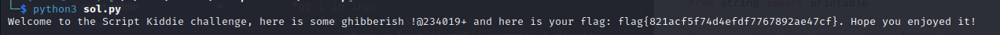

<font size='10'>Script Kiddie</font>

5<sup>th</sup> June 2024

Prepared By: `Muhammad Saad Akhtar`

Challenge Author(s): `Muhammad Saad Akhtar`

Category: `Misc/Scripting`

Difficulty: <font color='lightgreen'>Very Easy</font>

<br><br>

## Description

- In this challenge, the participants need to figure out the `gen.py` script and then brute-force the characters with corresponding `md5` hash to uncover the `description.txt` file containing the flag.

## Skills Required

- Researching Skills
- A little bit of python know how (to script the md5 brute-forcing process)

# Solution

We get a `chall.txt` file along with a `gen.py` file.

The `chall.txt` contains a number of `md5` hashes while the `gen.py` shows how this file is generated.

```python
import hashlib

desc_with_flag = open('description.txt').read()
out = []
out_file = open('chall.txt', 'w+')

for i in desc_with_flag:
    out.append(hashlib.md5(i.encode()).digest().hex())

for j in out:
    out_file.write(j + '\n')

out_file.close()
```

We see that for each character for `description.txt` file, it takes `md5` hash of the character and appends this in the `chall.txt` file.

So all we need to do here, is to brute-force the printable characters and match against their `md5` hash to get the contents of `description.txt`.

```python
import hashlib
from string import printable

inp = open('chall.txt').read().split('\n')

chars = printable

for i in inp:
    for j in chars:
        check = hashlib.md5(j.encode()).digest().hex()
        if (i == check):
            print(j, end="")
```



### Challenge Flag

`flag{821acf5f74d4efdf7767892ae47cf}`