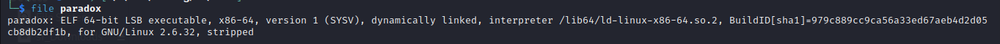
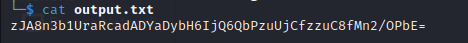
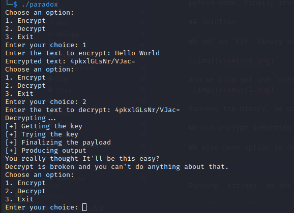
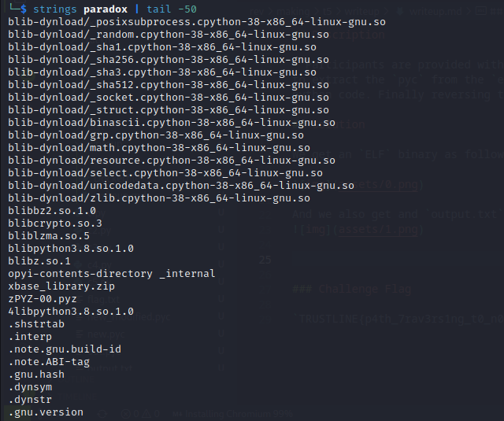
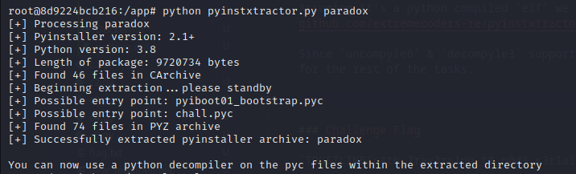
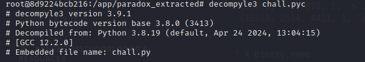
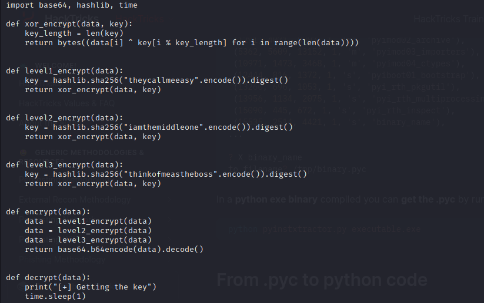
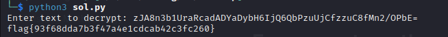

<font size='10'>Paradox</font>

03<sup>rd</sup> June 2024

Prepared By: `Muhammad Saad Akhtar`

Challenge Author(s): `Muhammad Saad Akhtar`

Category: `Reversing`

Difficulty: <font color='green'>Easy</font>


## Description

- Participants are provided with an `ELF` binary that's compiled using `pyinstaller`. They first need to extract the `pyc` from the `elf` then using `decompyle3` convert the `pyc` to `py` and get the python code. Finally reversing the XOR logic and decrypt the flag.

## Solution

We get an `ELF` binary as follows.



And we also get and `output.txt` file which has some seemingly `base64` encoded text.


Running the binary, we get 3 options.

We can encrypt something and it'll provide the base64 encoded output of the encrypted text.

We also have option to decrypt but that doesn't work.



Running `strings` on the binary, we see several entries mentioning python.



Assuming it's a python compiled `elf` we can try to extract the `pyc` using [pyinstxtractor](https://github.com/extremecoders-re/pyinstxtractor) and then use `decompyle3` to get the `py` code.

Since `uncompyle6` & `decompyle3` doesn't support python version 11 installed on my system, I'm using the following docker container for the rest of the tasks.

```Dockerfile
# Use the official Python 3.8 image as the base image
FROM python:3.8

# Optional: Set the working directory inside the container
WORKDIR /app

# Optional: Copy the contents of your local directory into the container
COPY . /app

# Install additional dependencies, if needed
RUN pip install decompyle3


# Specify a command to run when the container starts
CMD ["/bin/bash"]
```

Get the `pyc` using `pyinstxtractor`.



Now convert the `pyc` to `py` using `decompyle3`.




Following is the `py` code we got.

```python
import base64, hashlib, time

def xor_encrypt(data, key):
    key_length = len(key)
    return bytes((data[i] ^ key[i % key_length] for i in range(len(data))))


def level1_encrypt(data):
    key = hashlib.sha256("theycallmeeasy".encode()).digest()
    return xor_encrypt(data, key)


def level2_encrypt(data):
    key = hashlib.sha256("iamthemiddleone".encode()).digest()
    return xor_encrypt(data, key)


def level3_encrypt(data):
    key = hashlib.sha256("thinkofmeastheboss".encode()).digest()
    return xor_encrypt(data, key)


def encrypt(data):
    data = level1_encrypt(data)
    data = level2_encrypt(data)
    data = level3_encrypt(data)
    return base64.b64encode(data).decode()


def decrypt(data):
    print("[+] Getting the key")
    time.sleep(1)
    print("[+] Trying the key")
    time.sleep(2)
    print("[+] Finalizing the payload")
    time.sleep(1)
    print("[+] Producing output")
    time.sleep(2)
    return "You really thought It'll be this easy?\nDecrypt is broken and you can't do anything about that."


if __name__ == "__main__":
    main()
```

It's a simple script that's doing `XOR` three times with different keys.

We can create a decryption script as follows.

```python
import base64
import hashlib
import os

def xor_encrypt(data, key):
    key_length = len(key)
    return bytes(data[i] ^ key[i % key_length] for i in range(len(data)))

def level1_encrypt(data):
    key = hashlib.sha256("theycallmeeasy".encode()).digest()
    return xor_encrypt(data, key)

def level2_encrypt(data):
    key = hashlib.sha256("iamthemiddleone".encode()).digest()
    return xor_encrypt(data, key)

def level3_encrypt(data):
    key = hashlib.sha256("thinkofmeastheboss".encode()).digest()
    return xor_encrypt(data, key)

def level1_decrypt(data):
    return level1_encrypt(data)  # XOR with the same key will decrypt

def level2_decrypt(data):
    return level2_encrypt(data)  # XOR with the same key will decrypt

def level3_decrypt(data):
    return level3_encrypt(data)  # XOR with the same key will decrypt


def decrypt(data):
    data = base64.b64decode(data)
    data = level3_decrypt(data)
    data = level2_decrypt(data)
    data = level1_decrypt(data)
    return data.decode()


a = input("Enter text to decrypt: ")
res = decrypt(a)
print(res)
```

Providing the contents of `output.txt` to this script, we'll get the flag.




### Challenge Flag

`flag{93f68dda7b3f47a4e1cdcab42c3fc260}`