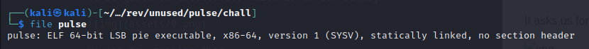
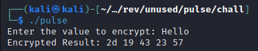
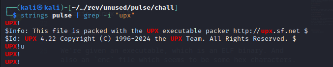
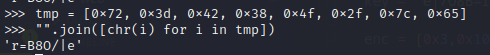
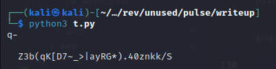
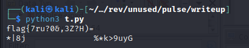
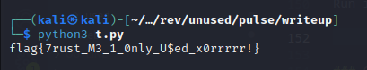

<font size='10'>Pulse</font>

16<sup>th</sup> May 2024

Prepared By: `Muhammad Saad Akhtar`

Challenge Author(s): `Muhammad Saad Akhtar`

Category: `Reversing`

Difficulty: <font color='green'>Easy</font>

<br><br>

## Description

- In this challenge, the participants need to first unpack a binary using upx and then analyze and reverse the encryption mechanism in the binary and craft a decryption script to get the flag.

## Skills Required

- Basic Linux CLI

# Solution

We're given an executable, which is an ELF binary. And also an `enc` file which seems to be some hex characters.



We can try running the ELF.



It asks us for a value to encrypt and then provide the encrypted result in hex format.

We can try decompiling the binary in ghidra but before that we need to unpack this.

with `strings` command, we see it's packed with `upx`.



So we can unpack it as follows.

```bash
┌──(kali㉿kali)-[~/…/rev/unused/pulse/chall]
└─$ upx -d pulse -o pulse-upxd
```

Next, we can now decompile it using `ghidra`.

In `ghidra` the main function is as follows.

```c
undefined8 main(void)

{
  size_t sVar1;
  byte local_f8 [112];
  undefined8 key;
  undefined8 local_80;
  char input [108];
  int local_c;
  
  key = 0x723d42384f2f7c65;
  local_80 = 0x3347382e563829;
  printf("Enter the value to encrypt: ");
  fgets(input,100,stdin);
  sVar1 = strcspn(input,"\n");
  input[sVar1] = '\0';
  xor_encrypt(input,&key,local_f8);
  printf("Encrypted Result: ");
  for (local_c = 0; local_f8[local_c] != 0; local_c = local_c + 1) {
    printf("%02x ",(ulong)local_f8[local_c]);
  }
  putchar(10);
  return 0;
}
```

It takes our input value and parse it in `xor_encrypt` function.

The `xor_encrypt` function also takes in `local_82` variable which seems to be the key.

Looking at the `xor_encrypt` function.

```c
void xor_encrypt(char *input,char *key,long param_3)

{
  size_t len_of_input;
  size_t len_of_key;
  int i;
  
  len_of_input = strlen(input);
  len_of_key = strlen(key);
  for (i = 0; i < (int)len_of_input; i = i + 1) {
    *(char *)(param_3 + i) = input[i] ^ key[i % (int)len_of_key];
  }
  *(undefined *)(param_3 + (int)len_of_input) = 0;
  return;
}
```

I cleaned up some variable names for ease of understanding.

Here, the xor_encryption is such that it is xoring each input character with a character of key.

But the problem here, is the key ghidra is showing us is `0x723d42384f2f7c65`.

Which if we convert to string, we get following.



So now if we make a reverse xor script as follows.

```python
key = 'r=B8O/|e'

enc = [0x3,0x10,0x4e,0x28,0x43,0x75,0x4f,0x7,0x5a,0x4c,0x9,0x63,0xb,0x18,0x2,0x3a,0x4c,0x41,0x23,0x41,0x1d,0x68,0x56,0x4c,0x5c,0x9,0x56,0x8,0x35,0x41,0x17,0xe,0x5d,0x6e,0x45]

result = ''

for i in range(len(enc)):
    result += chr(enc[i] ^ ord(key[i % len(key)]))

print(result)
```

And run it, we get nothing useful.



But if we reverse the key and run the script again,

```python
key = 'e|/O8B=r'

enc = [0x3,0x10,0x4e,0x28,0x43,0x75,0x4f,0x7,0x5a,0x4c,0x9,0x63,0xb,0x18,0x2,0x3a,0x4c,0x41,0x23,0x41,0x1d,0x68,0x56,0x4c,0x5c,0x9,0x56,0x8,0x35,0x41,0x17,0xe,0x5d,0x6e,0x45]

result = ''

for i in range(len(enc)):
    result += chr(enc[i] ^ ord(key[i % len(key)]))

print(result)
```

we see it doesn't quite return the complete flag but we still get some part of the flag.



Looking back at the ghidra's main function, we saw another variable right after our `key`.

```c
key = 0x723d42384f2f7c65;
local_80 = 0x3347382e563829;
```

If we combine both these variables, we'll get our full key.

***Note: this other variable also needs to be reversed then concatenated with initial key.***

So now our script becomes.

```python
key = 'e|/O8B=r)8V.8G3'

enc = [0x3,0x10,0x4e,0x28,0x43,0x75,0x4f,0x7,0x5a,0x4c,0x9,0x63,0xb,0x18,0x2,0x3a,0x4c,0x41,0x23,0x41,0x1d,0x68,0x56,0x4c,0x5c,0x9,0x56,0x8,0x35,0x41,0x17,0xe,0x5d,0x6e,0x45]

result = ''

for i in range(len(enc)):
    result += chr(enc[i] ^ ord(key[i % len(key)]))

print(result)
```

Run it and we'll get the flag.




### Challenge Flag

`flag{7rust_M3_1_0nly_U$ed_x0rrrrr!}`