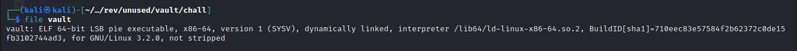
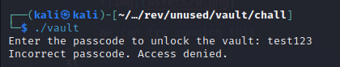
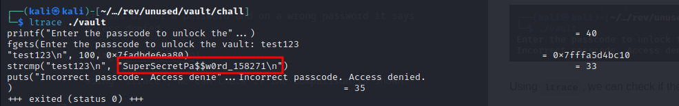
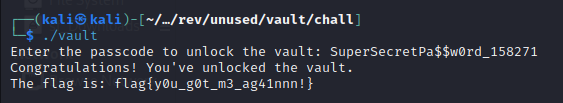

Vault

16th May 2024

Prepared By: `Muhammad Saad Akhtar`

Challenge Author(s): `Muhammad Saad Akhtar`

Category: `Reversing`

Difficulty: Very Easy

  

## Description

- In this challenge, the participants need to find the password to the vault either by `strings` command or by using `ltrace` and read the flag.

## Skills Required

- Basic Linux CLI

# Solution

We're given an executable, which is an ELF binary.

We can try running this.

It asks us for a password and on a wrong password it says access denied.

Using `ltrace`, we can check if the comparison is shown.

We can see the password in clear text.

`SuperSecretPa$$w0rd_158271`

Run the binary again and enter the password to get the flag.

### Challenge Flag

`flag{y0u_g0t_m3_ag41nnn!}`