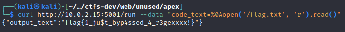

<font size='10'>Apex</font>

16<sup>th</sup> May 2024

Prepared By: `Muhammad Saad Akhtar`

Challenge Author(s): `Muhammad Saad Akhtar`

Category: `Web`

Difficulty: <font color='green'>Easy</font>

<br><br>

## Description

- In this challenge, the participants need to find a vulnerability in the regular expression being used to filter out the input. By inserting a newline character, the participants can bypass the regex and gain code execution on the server due to the usage of `eval`.

## Skills Required

- Information Gathering
- Researching Skills
- A little bit of python know how (otherwise you'll get it with googling)

# Solution

The participants are provided with a URL to access the application.

Upon visiting the URL, we can see a page with an input box.


Whatever, we write on the input field it just says `Hacking not allowed!`.


We're also provided with the source code so let's analyze it.

The `app.py` file is as follows.

```python
from flask import Flask, request, jsonify, render_template
import re

app = Flask(__name__)

@app.route('/')
def index():
    return render_template('index.html')

@app.route('/run', methods=['POST'])
def run_code():
    code_text = request.form.get('code_text', '')
    if has_non_ascii(code_text):
        return jsonify({"output_text": "Hacking not allowed!"}), 403
    result_text = ""
    try:
        result_text = eval(code_text)
    except Exception as e:
        result_text = str(e)

    return jsonify({"output_text": result_text}), 200

def has_non_ascii(text_string):
    ascii_pattern = re.compile(r".*[\x20-\x7E]+.*")
    return ascii_pattern.match(text_string)

if __name__ == "__main__":
    app.run(host="0.0.0.0", port=5001, debug=False)
```

We see when we click on the execute button, the `/run` api is called. It takes a parameter `code_text` and parse it on `has_non_ascii()` function.

```python
@app.route('/run', methods=['POST'])
def run_code():
    code_text = request.form.get('code_text', '')
```

The `has_non_ascii()` function takes our input and match it against a regex.

```python
def has_non_ascii(text_string):
    ascii_pattern = re.compile(r".*[\x20-\x7E]+.*")
    return ascii_pattern.match(text_string)
```

The above regex just blocks any printable `ascii` characters.

If we somehow bypass this regex, we our input will then be parsed into `eval`.

```python
if has_non_ascii(code_text):
        return jsonify({"output_text": "Hacking not allowed!"}), 403
    result_text = ""
    try:
        result_text = eval(code_text)
```

[This](https://davidhamann.de/2022/05/14/bypassing-regular-expression-checks/) article explains that python's `re.match` would match the beginning of a string but not the beginning of each line.

So what if we enter a new line and then parse our input?

Let's try that.

We can use curl as follows to enter a new line.


Notice the difference, if I parse `ls` normally it would say `Hacking not allowed!` but if I parse it with a new line, it says `ls` not defined. 

So we bypassed this regex using a newline.

***Note: I use CTRL-V then CTRL-J to get a newline in terminal for curl***

Another way of this is to add a `%0A` which also represents a newline character.


Now we have access to `eval` function.

We can see [here](https://vk9-sec.com/exploiting-python-eval-code-injection/) that `eval` evaluates a string as python expression. So we can use something like following to get code execution.


As can be seen from above ss, we can list directories and files with `os.listdir()`.

Now there are many ways to read the flag, either by gaining a shell on the remote host or simply by using `open`.

From the `Dockerfile`, we see the flag is in `/` directory.




### Challenge Flag

flag{1_ju$t_byp4ssed_4_r3gexxxx!}