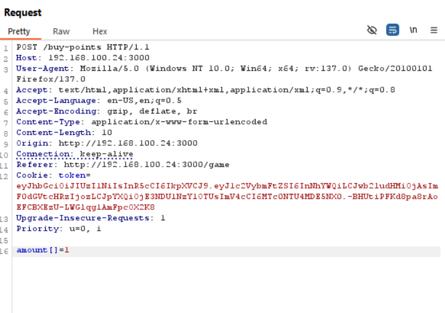

<font size='10'>flag shop</font>

24<sup>th</sup> April 2025

Challenge Author(s): `Muhammad Saad Akhtar`

Category: `Web`

Difficulty: <font color='green'>Easy</font>

<br><br>

## Solution

Opening the website it shows the following.


We see an input box and if we enter our username, it redirects us to `/game`.


We see that it says we can buy some points and then get the flag from the points.

But there are some restrictions. We only have 3 attempts to buy the points and we can only enter a number b/w 0-99 to buy.

Looking at the source code, if we have points greater than `13371337` then we can get the flag.

```javascript
app.get('/get-flag', authenticate, (req, res) => {
  if (req.user.points > 13371337) {
    res.send('Congrats! Here is your flag: flag{fake_flag}');
  } else {
    res.send('Not enough points to get the flag.');
  }
});
```

Now on the `/buy-points` endpoint, we see that there's no type check on our input.

It first saves our input as is first.

```javascript
const amount = req.body.amount;
```

Then it uses `parseInt` to save it as our points.

```javascript
user.points += parseInt(amount);
```

A very good article on explaining this vulnerability is [here](https://snyk.io/blog/remediate-javascript-type-confusion-bypassed-input-validation/)

If we run the code locally, we can do some console.logging to validate how our input behaves differently while parsing it differently in the application.


Now if we parse amount value normally it outputs as follows.


But if we parse amount as below.



We can see a change in the console output.


Now even if we provide a number greater than 2 digits, it would accept it.


Why did it accepted it? The condition is:

```javascript
else if (amount.length > 2)
```

But our amount is `['13371338']`. And if we do length check on this, we'll see it returns `1`.


This satisfies our condition and we get the required amount to get the flag.


Simply click get flag and we'll have the flag.


### Challenge Flag

flag{typ3_c0nfu$i0n_g4v3_m3_up}